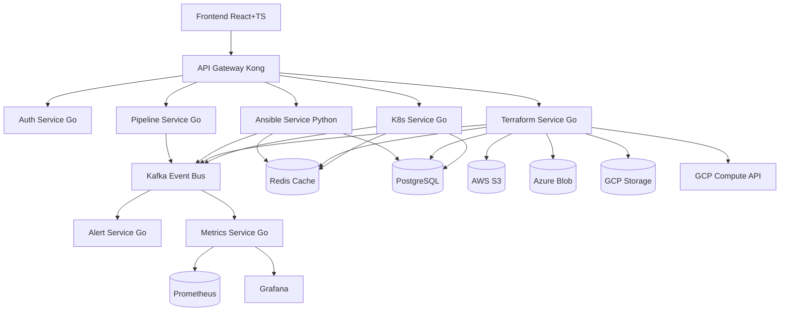
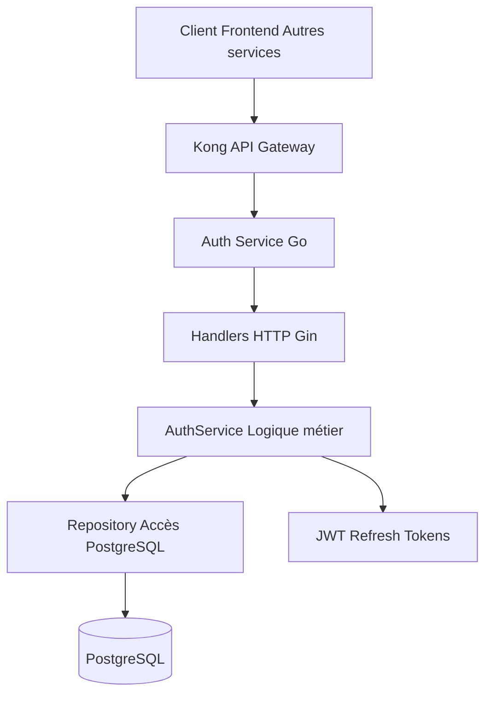

## Contexte et objectifs du projet

Kura est une plateforme DevOps unifiée qui vise à donner **une vue centrale** sur plusieurs briques déjà très utilisées en entreprise : Kubernetes, Terraform, Ansible, pipelines CI/CD, métriques et alertes.

### Ce qui existe déjà sur le marché

- **Outils spécialisés mais isolés** :
  - Portails Kubernetes (Lens, Octant, dashboards maison),
  - Outils Terraform (Terraform Cloud, Atlantis),
  - Interfaces Ansible Tower / AWX,
  - Outils CI/CD (GitHub Actions, GitLab CI, Jenkins),
  - Stacks d’observabilité (Prometheus / Grafana).
  
- **Portails développeur / Developer Portals** :
  - **Backstage (Spotify)** : plateforme open-source pour créer des portails développeur, catalogue de services, documentation, plugins CI/CD.
  - **Port** : plateforme SaaS similaire à Backstage, focus sur la découverte et la gouvernance.
  - **Cortex** : catalogue de microservices avec scoring et dépendances.
  
- **Problèmes communs à ces solutions** :
  - Les outils spécialisés isolés : les équipes jonglent entre **plusieurs interfaces**, difficile d’avoir une **vision transversale** (ex. : « ce pipeline déploie quels clusters / quelles ressources Terraform ? »), l’authentification et les rôles sont souvent **dupliqués** dans chaque outil.
  - Les Developer Portals (Backstage, Port, Cortex) : excellents pour la **découverte** et la **documentation**, mais souvent **légers sur l’opérationnel** (gestion active des clusters K8s, exécution Terraform, jobs Ansible, alertes temps réel). Ils sont plutôt orientés « catalogue » que « console d’opération ».

### La valeur ajoutée de Kura

- **Point d’entrée unique** pour les équipes Ops / DevOps : un seul portail, une seule API Gateway.
- **Agrégation** des infos clés (clusters, états Terraform, jobs Ansible, pipelines, métriques) au même endroit.
- **Modèle d’authentification centralisé** (auth-service) et rôles homogènes sur tous les modules.
- **Événements corrélés** via Kafka (ex. : un déploiement Terraform qui déclenche des métriques et des alertes associées).
- **Différenciation vs Backstage/Port** :
  - Kura se concentre sur l’**opérationnel actif** (exécution Terraform, gestion K8s, jobs Ansible) plutôt que sur le catalogue/documentation.
  - Architecture **microservices native** avec bus d’événements Kafka pour corréler les actions entre systèmes.
  - **Focus Ops/DevOps** : console d’opération plutôt que portail développeur (même si les deux peuvent coexister).

### Pourquoi c’est faisable

- Tous les composants ciblés exposent déjà :
  - Des **API HTTP** (Kubernetes, Terraform Cloud, Ansible Tower, outils CI/CD),
  - Des **endpoints d’observabilité** (Prometheus, logs, etc.).
- L’architecture choisie (microservices + Kafka + Postgres + Redis) est **classique et éprouvée** dans l’écosystème cloud-native.
- Le périmètre est découpé par domaines (`auth-service`, `k8s-service`, `terraform-service`, etc.) ce qui permet d’avancer **service par service** sans tout faire d’un coup.

### Pourquoi c’est utile

- Réduit la **charge cognitive** : moins d’outils à connaître pour les équipes.
- Facilite les **diagnostics cross-systèmes** (pipeline → déploiement → métriques → alertes).
- Permet de mettre en place des **garde-fous globaux** (rôles, droits, observabilité, audit) au niveau de la plateforme, pas outil par outil.

---

## Architecture globale Kura

Ce document décrit l’architecture haut niveau de la plateforme Kura ainsi que le détail du service d’authentification (`auth-service`).

### Vue globale

## Architecture détaillée du service d’authentification

Cette vue se concentre uniquement sur `auth-service` et ses dépendances directes.

### Flux principal (MVP actuel)

- **Inscription** (`/api/v1/auth/register`)  
  - Le client envoie les infos → Kong → `auth-service`  
  - `Handlers` → `AuthService` → `Repository` → table `users` dans PostgreSQL.

- **Connexion** (`/api/v1/auth/login`)  
  - Vérification mot de passe (bcrypt)  
  - Génération d’un **JWT** + **refresh token**  
  - Persisté dans la table `refresh_tokens`.

- **Accès protégé** (`/api/v1/auth/me`, etc.)  
  - Le client envoie `Authorization: Bearer <JWT>`  
  - Middleware de `auth-service` valide le token et ajoute l’ID utilisateur au contexte.

En résumé :

- le schéma global explique **comment les services discutent entre eux** (Kong, Kafka, Postgres, Redis, Prometheus, Grafana) ;
- le schéma détaillé d’`auth-service` montre **comment l’authentification est centralisée et découplée** :
  - les `Handlers` gèrent uniquement HTTP,
  - `AuthService` porte la logique métier (mots de passe, rôles, JWT, refresh tokens),
  - le `Repository` encapsule l’accès à PostgreSQL.

